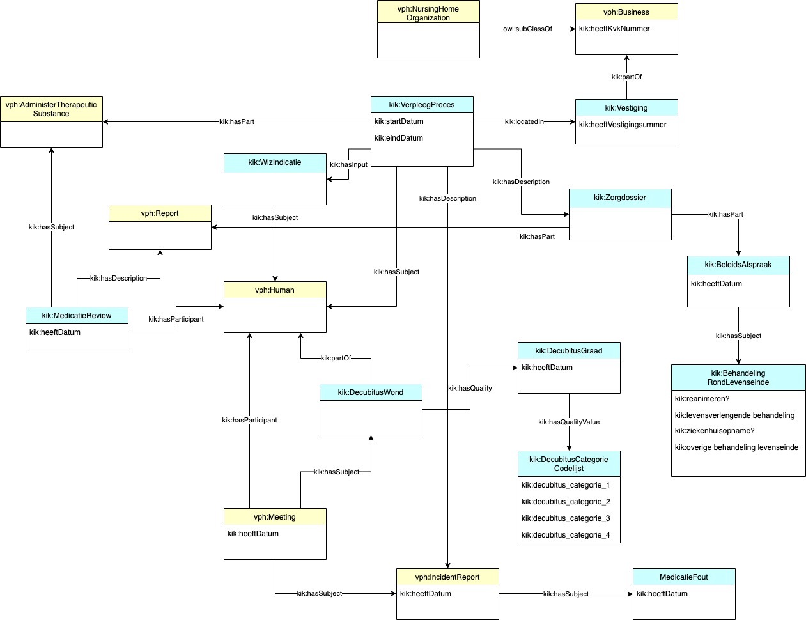

# Inhoud  
## Concepten  
[Toediening van medicatie](#Toediening-van-medicatie)  
[Onderneming](#Onderneming)  
[Persoon](#Persoon)  
[IncidentReport](#IncidentReport)  
[Bijeenkomst](#Bijeenkomst)  
[Verpleeghuis](#Verpleeghuis)  
[Report](#Report)  
[Behandeling rond levenseinde](#Behandeling-rond-levenseinde)  
[Beleidsafspraak](#Beleidsafspraak)  
[Decubituscategorie codelijst](#Decubituscategorie-codelijst)  
[Decubitusgraad](#Decubitusgraad)  
[Vestiging](#Vestiging)  
[Wlz-indicatie](#Wlz-indicatie)  
## Relaties  
[heeft beschrijving](#heeft-beschrijving)  
[heeft input](#heeft-input)  
[heeft onderdeel](#heeft-onderdeel)  
[heeft deelnemer](#heeft-deelnemer)  
[heeft kwaliteit](#heeft-kwaliteit)  
[heeft onderwerp](#heeft-onderwerp)  
[heeft lokatie](#heeft-lokatie)  
## Eigenschappen  
[einddatum](#einddatum)  
[BSN](#BSN)  
[heeft datum](#heeft-datum)  
[startdatum](#startdatum)  
# Concepten
### [Toediening van medicatie](http://www.zinl.nl/ontologies/VPH-domain-ontology#AdministerTherapeuticSubstance)  
Editorial: AdministerTherapeuticSubstance is the subclass of SocialInteraction where some Person applies or uses some TherapeuticSubstance or PharmaceuticalArtifact with the intent to cure, alleviate or prevent some (symptom of a) DiseaseOrSyndrome.  
_(Toediening van medicatie_ is een _[TherapeuticIntervention](http://www.zinl.nl/ontologies/VPH-domain-ontology#TherapeuticIntervention)_)  
### [Onderneming](http://www.zinl.nl/ontologies/VPH-domain-ontology#Business)  
Editorial: Bedrijf is een Organisatie die producten en/of diensten levert in ruil voor een financiele vergoeding en daarbij een winstoogmerk heeft.  
Editorial: Business is an Organization that provides products and/or services in exchange for money with the aim of making a profit.  
_(Onderneming_ is een _[Organisatie](http://www.zinl.nl/ontologies/VPH-domain-ontology#Organization)_)  
### [Persoon](http://www.zinl.nl/ontologies/VPH-domain-ontology#Human)  
Een natuurlijk persoon.  
_(Persoon_ is een _[Mammal](http://www.zinl.nl/ontologies/VPH-domain-ontology#Mammal)_)  
### [IncidentReport](http://www.zinl.nl/ontologies/VPH-domain-ontology#IncidentReport)  
Editorial: Een Incidentrapportage is een Rapport waarin verslag wordt gedaan van een niet-beoogde of onverwachte gebeurtenis, die betrekking heeft op de kwaliteit van de zorg, en heeft geleid, had kunnen leiden of zou kunnen leiden tot schade bij de cliënt.

(Definitie 'incident' uit: Wet Kwaliteit, Klachten en Geschillen Zorg)  
_(IncidentReport_ is een _[Report](http://www.zinl.nl/ontologies/VPH-domain-ontology#Report)_)  
### [Bijeenkomst](http://www.zinl.nl/ontologies/VPH-domain-ontology#Meeting)  
Een bijeenkomst is een proces waarbij twee of meer cognitieve agents (digitaal) bijeenkomen met als doel te communiceren.  
_(Bijeenkomst_ is een _[IntentionalProcess](http://www.zinl.nl/ontologies/VPH-domain-ontology#IntentionalProcess)_)  
### [Verpleeghuis](http://www.zinl.nl/ontologies/VPH-domain-ontology#NursingHomeOrganization)  
Editorial: NursingHomeOrganization is a CareOrganization that provides clustered accomodation, nursing, care and assistance with activities of daily living for Persons who are (temporary) unable to care for themselves due to a handicap, illness or condition.  
Editorial: VerpleeghuisOrganisatie is een ZorgOrganisatie die zich richt op het geclusterd verlenen van woonruimte en intensieve zorg en verpleging voor Personen die door ziekte of beperking (tijdelijk) niet in staat zijn zelfstandig te wonen.  
_(Verpleeghuis_ is een _[CareOrganization](http://www.zinl.nl/ontologies/VPH-domain-ontology#CareOrganization)_)  
_(Verpleeghuis_ is een _[Onderneming](http://www.zinl.nl/ontologies/VPH-domain-ontology#Business)_)  
### [Report](http://www.zinl.nl/ontologies/VPH-domain-ontology#Report)  
Editorial: Report is a physical or digital Document that describes the findings of a study or experiment, or a series of observations.  
_(Report_ is een _[Document](http://www.zinl.nl/ontologies/VPH-domain-ontology#Document)_)  
### [Behandeling rond levenseinde](https://www.purl.org/kik/BehandelingRondLevenseinde)  
Onderwerpen omtrent behandeling rond het levenseinde waarover beleidsafspraken met client kunnen worden gemaakt.  
_(Behandeling rond levenseinde_ is een _[Overeenkomst onderwerp](https://www.purl.org/kik/AgreementSubject)_)  
### [Beleidsafspraak](https://www.purl.org/kik/BeleidsAfspraak)  
Een overeenkomst waarbij de specifieke toepassing van een bepaald beleid wordt overeengekomen.  
_(Beleidsafspraak_ is een _[Overeenkomst](http://www.zinl.nl/ontologies/VPH-domain-ontology#Agreement)_)  
### [Decubituscategorie codelijst](https://www.purl.org/kik/DecubitusCategorieCodelijst)  
Lijst van categorieën om de ernst van een decubitus wond te categoriseren.  
_(Decubituscategorie codelijst_ is een _[MedicalRatingValue](http://www.zinl.nl/ontologies/VPH-domain-ontology#MedicalRatingValue)_)  
### [Decubitusgraad](https://www.purl.org/kik/DecubitusGraad)  
Beschrijving van de toestand van decubituswond op een bepaald tijdstip.
Meestal volgens de Decubituscategorie codelijst volgens de V&VN Wondzorg definitie.  
_(Decubitusgraad_ is een _[InternalQuality](http://www.zinl.nl/ontologies/VPH-domain-ontology#InternalQuality)_)  
### [Vestiging](https://www.purl.org/kik/Vestiging)  
Een gebouw of complex van gebouwen waar duurzame uitoefening van de activiteiten van een onderneming of rechtspersoon plaatsvindt.  
_(Vestiging_ is een _[Verblijfsobject](https://www.purl.org/kik/Verblijfsobject)_)  
### [Wlz-indicatie](https://www.purl.org/kik/WlzIndicatie)  
Een besluit waarin staat welk recht iemand heeft op langdurige zorg.  
_(Wlz-indicatie_ is een _[Indicatiebesluit](https://www.purl.org/kik/IndicatieBesluit)_)  

# Relaties
### [heeft beschrijving](https://www.purl.org/kik/hasDescription)  
Legt een relatie tussen een instantie en een beschrijving van die instantie  
### [heeft input](https://www.purl.org/kik/hasInput)  
Geeft de input aan. 
Voorbeeld: een WLZ indicatie vormt de input voor het zorgproces van een client.  
### [heeft onderdeel](https://www.purl.org/kik/hasPart)  
Een kernrelatie die geldt tussen een geheel en een onderdeel daarvan.  
### [heeft deelnemer](https://www.purl.org/kik/hasParticipant)  
Een relatie tussen een proces (perdurant) en een endurant die op enige manier betrokken is in dat proces.  
### [heeft kwaliteit](https://www.purl.org/kik/hasQuality)  
Verwijst naar een kwaliteit.  
### [heeft onderwerp](https://www.purl.org/kik/hasSubject)  
Verwijst naar het onderwerp waarover iets gaat. 
Voorbeeld: een zorgdossier heeft_onderwerp client waarover het dossier gaat.  
### [heeft lokatie](https://www.purl.org/kik/locatedIn)  
Een relatie tussen twee perdurants, het subject en de locatie waarin het subject zich geheel bevindt.  

# Eigenschappen
### [einddatum](https://www.purl.org/kik/eindDatum)  
(datum)  
De datum waarop een interval eindigt.  
### [BSN](https://www.purl.org/kik/heeftBSN)  
Het nummer waarmee ieder Nederlandse burger uniek geïdentificeerd kan worden.  
### [heeft datum](https://www.purl.org/kik/heeftDatum)  
(datum)  
een datum die kenmerkend is  
### [startdatum](https://www.purl.org/kik/startDatum)  
(datum)  
De datum waarop een interval start  
