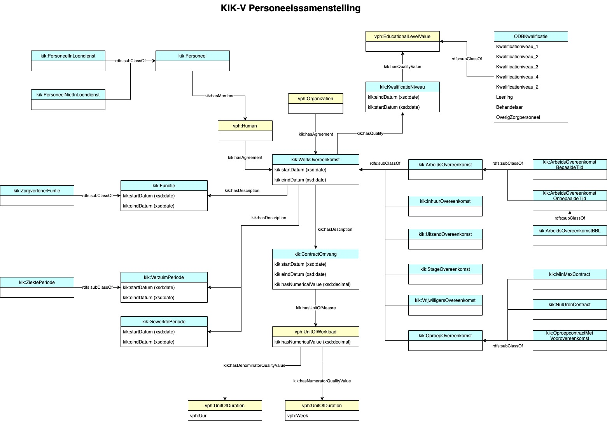

# Inhoud  
## Concepten  
[Arbeidsovereenkomst](#Arbeidsovereenkomst)  
[Arbeidsovereenkomst bepaalde tijd](#Arbeidsovereenkomst-bepaalde-tijd)  
[Arbeidsovereenkomst onbepaalde tijd](#Arbeidsovereenkomst-onbepaalde-tijd)  
[Contractomvang](#Contractomvang)  
[Functie](#Functie)  
[Gewerkte periode](#Gewerkte-periode)  
[Kwalificatieniveau](#Kwalificatieniveau)  
[ODB Kwalificatieniveau](#ODB-Kwalificatieniveau)  
[Oproepovereenkomst](#Oproepovereenkomst)  
[Personeel](#Personeel)  
[Personeel in loondienst](#Personeel-in-loondienst)  
[Personeel niet in loondienst](#Personeel-niet-in-loondienst)  
[Stage-overeenkomst](#Stage-overeenkomst)  
[Uitzendovereenkomst](#Uitzendovereenkomst)  
[Verzuimperiode](#Verzuimperiode)  
[Vrijwilligersovereenkomst](#Vrijwilligersovereenkomst)  
[Werkovereenkomst](#Werkovereenkomst)  
[Ziekteperiode](#Ziekteperiode)  
[Zorgverlener (functie)](#Zorgverlener-(functie))  
## Relaties  
[heeft overeenkomst](#heeft-overeenkomst)  
[heeft beschrijving](#heeft-beschrijving)  
[heeft kwaliteit](#heeft-kwaliteit)  
## Eigenschappen  
[einddatum](#einddatum)  
[gewerkte uren](#gewerkte-uren)  
[numerieke waarde](#numerieke-waarde)  
[startdatum](#startdatum)  
# Samenhang overeenkomst, rol en groep
```bash
Soort overeenkomst                                  Bijbehorende rol            Groep
------------------------------------------------------------------------------------------------------------

Werkovereenkomst                                    Medewerker                  -
│                                                   │
├── Inhuurovereenkomst                              ├── ZZPer                   Personeel niet in loondienst
│                                                   │
├── Arbeidsovereenkomst                             ├── Werknemer               Personeel in loondienst                        
│   ├── Arbeidsovereenkomst bepaalde tijd           │   │
│   │   └── Arbeidsovereenkomst BBL                 │   └── Leerling-Werknemer
│   └── Arbeidsovereenkomst onbepaalde tijd         │
│                                                   │
├── Oproepovereenkomst                              ├── Werknemer               Personeel in loondienst
│   ├── Min-max contract                            │
│   ├── Nuluren contract                            │
│   └── Oproepovereenkomst met voorovereenkomst     │
│                                                   │
├── Stageovereenkomst                               ├── Stagiair                -
│                                                   │
├── Uitzendovereenkomst                             Medewerker                  Personeel niet in loondienst
│   └── Payrollovereenkomst                         │
│                                                   │
└── Vrijwilligersovereenkomst                       └── Vrijwilliger            -
```
# Concepten
### [Arbeidsovereenkomst](https://mnieuwland.github.io/kik/#ArbeidsOvereenkomst)  
Een arbeidsovereenkomst is een overeenkomst waarbij de ene partij, de werknemer, in dienst van een andere partij, de werkgever, tegen betaling van loon arbeid verricht. Een arbeidsovereenkomst kan zowel voor bepaalde als voor onbepaalde tijd worden gesloten.

Er is sprake van een arbeidsovereenkomst als aan een drietal voorwaarden is voldaan:
* Er is sprake van het verrichten van ‘arbeid’;
* Voor de verrichte arbeid wordt ‘loon’ betaald;
* Er is een zekere ‘gezagsverhouding’ tussen werkgever en werknemer.  
_(Arbeidsovereenkomst_ is een _Werkovereenkomst)_  
### [Arbeidsovereenkomst bepaalde tijd](https://mnieuwland.github.io/kik/#ArbeidsOvereenkomstBepaaldeTijd)  
Een arbeidsovereenkomst waarbij op het moment van aangaan van de overeenkomst het moment wordt overeengekomen waarop de overeenkomst eindigt.  
_(Arbeidsovereenkomst bepaalde tijd_ is een _Arbeidsovereenkomst)_  
### [Arbeidsovereenkomst onbepaalde tijd](https://mnieuwland.github.io/kik/#ArbeidsOvereenkomstOnbepaaldeTijd)  
Een arbeidsovereenkomst waarbij op het moment van aangaan van de overeenkomst geen moment wordt overeengekomen waarop de overeenkomst eindigt.  
_(Arbeidsovereenkomst onbepaalde tijd_ is een _Arbeidsovereenkomst)_  
### [Contractomvang](https://mnieuwland.github.io/kik/#ContractOmvang)  
De omvang van een werkovereenkomst, uitgedrukt in de hoeveelheid werk (meestal in uren) die verricht moet worden in een periode (meestal een week). 

Voorbeeld: contractomvang is 36 uur per week.  
_(Contractomvang_ is een _Beschrijving)_  
### [Functie](https://mnieuwland.github.io/kik/#Functie)  
De functie zoals omschreven in een werkovereenkomst, welke indicatief is voor het soort werk dat verricht wordt in het kader van die overeenkomst.  
_(Functie_ is een _Beschrijving)_  
### [Gewerkte periode](https://mnieuwland.github.io/kik/#GewerktePeriode)  
Beschrijving van een periode waarin gewerkt is als onderdeel van een Werkovereenkomst.
Aan de periode, aangeduid met startdatum en einddatum, wordt gekoppeld het aantal gewerkte uren in de periode.  
_(Gewerkte periode_ is een _Beschrijving)_  
### [Kwalificatieniveau](https://mnieuwland.github.io/kik/#Kwalificatieniveau)  
Het kwalificatieniveau van een medewerker (gebaseerd op opleiding), van een funcie (gebaseerd op de bijbehorende overeenkomst of vacaturetekst) of een opleiding (vastgesteld op basis van he niveau dat vereist is om de opleiding succesvol af te ronden).  
_(Kwalificatieniveau_ is een _Kwaliteit)_  
### [ODB Kwalificatieniveau](https://mnieuwland.github.io/kik/#ODBKwalificatie)  
Het kwalificatieniveau van de zorgverleners geeft aan welk niveau aan kwaliteitseisen (middels opleiding en scholing) gesteld wordt aan de medewerkers c.q. functies die ingezet worden bij het leveren van zorg- en dienstverlening aan de cliënten. Het kwalificatieniveau wordt gebaseerd op basis van de arbeidsovereenkomst en inzet van de medewerker. De FWG-functieindeling kan gebruikt worden als leidraad voor het indelen op kwalificatieniveau.

Leerling-medewerkes en stagiaries worden, als afzonderlijke categorieen, meegeteld bij het kwalificatieniveau waar zij voor opgeleid worden.  
_(ODB Kwalificatieniveau_ is een _Opleidingskwalificatiewaarde)_  
### [Oproepovereenkomst](https://mnieuwland.github.io/kik/#OproepOvereenkomst)  
Er is sprake van een oproepovereenkomst

Als u geen loon krijgt wanneer u niet werkt;
Als het aantal uren werk niet is vastgelegd in een tijdvak van hoogstens een maand of hoogstens een jaar. En als u recht op loon ongelijkmatig (over dat tijdvak) is verspreid. Dat betekent dat u bijvoorbeeld de ene maand 20 uur per week werkt en de maand erna 30 uur, en u ook die uren gelijk uitbetaald krijgt (en dus steeds verschillende beloond wordt).
Werkt u een vast aantal uur per week, maand of jaar met een gelijkmatig loon maar heeft u ook aanwezigheidsdiensten, beschikbaarheidsdiensten of consignatiediensten? Er is geen sprake van een oproepovereenkomst als de uren worden vergoed of gecompenseerd met vrije tijd. Ook als u een bepaald aantal uren per jaar met uw werkgever heeft afgesproken, en u gelijkmatig over het jaar betaald krijgt heeft u geen oproepcontact (dit heet een jaarurennorm).  
_(Oproepovereenkomst_ is een _Werkovereenkomst)_  
### [Personeel](https://mnieuwland.github.io/kik/#Personeel)  
Personeel is een groep, waarvan de leden personen zijn die beschikken over een Arbeidsovereenkomst, Oproepovereenkomst, Uitzendovereenkomst of een Inhuurovereenkomst.  
_(Personeel_ is een _http://www.zinl.nl/ontologies/VPH-domain-ontology#GroupOfHumans)_  
### [Personeel in loondienst](https://mnieuwland.github.io/kik/#PersoneelInLoondienst)  
Personeel in loondienst is een groep, waarvan de leden personen zijn die beschikken over een Arbeidsovereenkomst of Oproepovereenkomst.  
_(Personeel in loondienst_ is een _Personeel)_  
### [Personeel niet in loondienst](https://mnieuwland.github.io/kik/#PersoneelNietInLoondienst)  
Personeel niet in loondienst (PNIL) is een groep, waarvan de leden personen zijn die beschikken over een Uitzendovereenkomst of Inhuurovereenkomst.  
_(Personeel niet in loondienst_ is een _Personeel)_  
### [Stage-overeenkomst](https://mnieuwland.github.io/kik/#StageOvereenkomst)  
In geval van een stage-overeenkomst is er doorgaans niet tevens een arbeidsovereenkomst. De stagewerkzaamheden zijn vaak gericht op het opdoen van ervaring als onderdeel van een opleiding, waardoor stagiaires meer zijn te vergelijken met studenten in plaats van met medewerkers die productief werk leveren. Normaal gesproken wordt er ook geen loon gegeven, maar hoogstens een onkostenvergoeding. De verhouding tussen stagiair(e) en stagegever, is echter doorgaans wel van dien aard dat er van een gezagsverhouding gesproken kan worden. Dat betekent voor de stagegever dat hij de regels over de arbeidsomstandigheden, arbeidstijden  en gelijke behandeling moet naleven tegen over de stageloper, als ware hij werkgever. Brengt een CAO een bijzondere regeling van arbeidstijden met zich mee, dan geldt deze in beginsel niet voor stagiaires, hoewel het de bedoeling kan zijn dat zij hier wel onder vallen.  
_(Stage-overeenkomst_ is een _Werkovereenkomst)_  
### [Uitzendovereenkomst](https://mnieuwland.github.io/kik/#UitzendOvereenkomst)  
De uitzendovereenkomst is de arbeidsovereenkomst waarbij de werknemer door de werkgever, in het kader van de uitoefening van het beroep of bedrijf van de werkgever ter beschikking wordt gesteld van een derde om krachtens een door deze aan de werkgever verstrekte opdracht arbeid te verrichten onder toezicht en leiding van de derde.  
_(Uitzendovereenkomst_ is een _Werkovereenkomst)_  
### [Verzuimperiode](https://mnieuwland.github.io/kik/#VerzuimPeriode)  
Beschrijving van een periode (met start- en einddatum) waarin de overeengekomen arbeid volgens een werkovereenkomst deels of geheel niet is verricht.
Het einde van deze periode kan beschreven worden met de laatste dag van de period (einddatum), of de eerste dag na afloop van de periode (hersteldatum). De hersteldatum ligt dus altijd één dag na de einddatum.  
_(Verzuimperiode_ is een _http://www.zinl.nl/ontologies/VPH-domain-ontology#SocialDescription)_  
### [Vrijwilligersovereenkomst](https://mnieuwland.github.io/kik/#VrijwilligersOvereenkomst)  
_(Vrijwilligersovereenkomst_ is een _Werkovereenkomst)_  
### [Werkovereenkomst](https://mnieuwland.github.io/kik/#WerkOvereenkomst)  
Een overeenkomst met betrekking tot het verrichten van werkzaamheden.  
_(Werkovereenkomst_ is een _Overeenkomst)_  
### [Ziekteperiode](https://mnieuwland.github.io/kik/#ZiektePeriode)  
Een ziekte priode is een verzuimperiode met ziekte als oorzaak van het verzuim.  
_(Ziekteperiode_ is een _Verzuimperiode)_  
### [Zorgverlener (functie)](https://mnieuwland.github.io/kik/#ZorgverlenerFunctie)  
Zorgverlener (functie) is een verzamelbegrip van alle functies (zoals omschreven in een werkovereenkomst) die geclassificeerd kunenn worden als een zorgverlenende functie. 
Met ander woorden: de persoon die een dergelijke functie uitoefent wordt geacht tenminste gedeeltelijk als taak te hebben beroepsmatig zorg te verlenen.
Dit begrip behoeft nadere definitie.  
_(Zorgverlener (functie)_ is een _Functie)_  

# Relaties
### [heeft overeenkomst](https://mnieuwland.github.io/kik/#hasAgreement)
Legt een relatie tussen de eigenaar van een overeenkomst en die overeenkomst.  
### [heeft beschrijving](https://mnieuwland.github.io/kik/#hasDescription)
Legt een relatie tussen een instantie en een beschrijving van die instantie  
### [heeft kwaliteit](https://mnieuwland.github.io/kik/#hasQuality)
Verwijst naar een kwaliteit.  

# Eigenschappen
### [einddatum](https://mnieuwland.github.io/kik/#eindDatum)
(datum)  
De datum waarop een interval eindigt.  
### [gewerkte uren](https://mnieuwland.github.io/kik/#gewerkteUren)
Aantal uren dat gewerkt is binnen een bepaalde periode  
### [numerieke waarde](https://mnieuwland.github.io/kik/#hasNumericalValue)
De numerieke waarde van een zekere uitkomst.  
### [startdatum](https://mnieuwland.github.io/kik/#startDatum)
(datum)  
De datum waarop een interval start  
